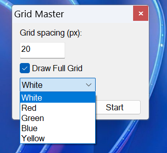
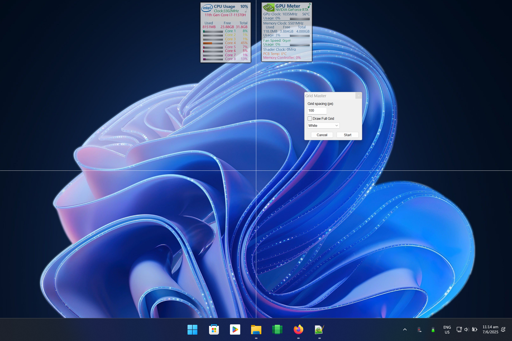
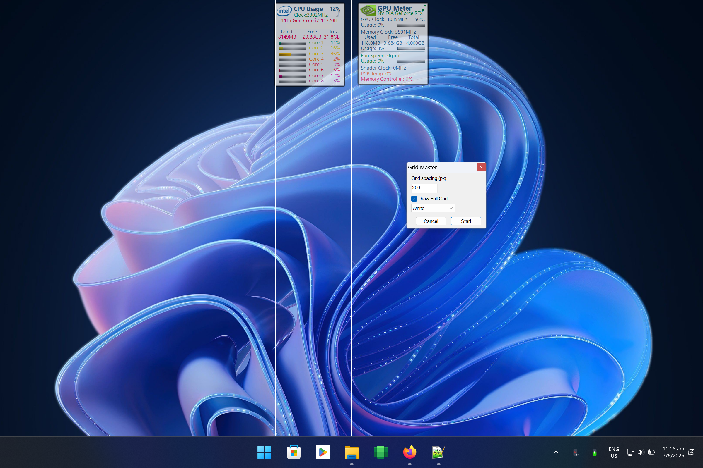
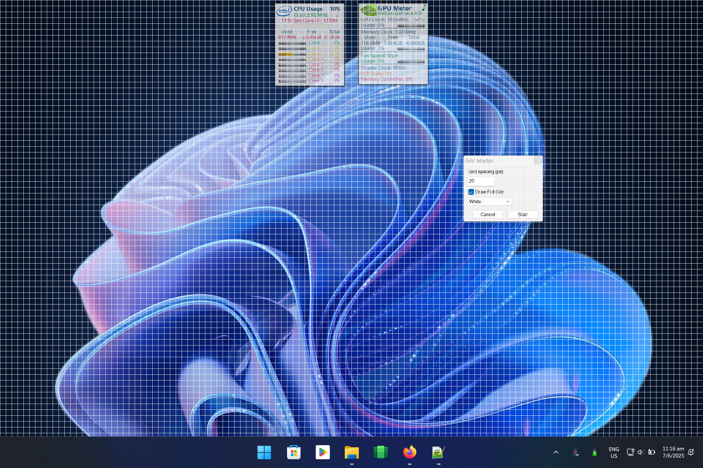

# Grid Master

**Grid Master** is a lightweight and portable utility built for those who crave **pixel-perfect alignment** on their screen. Made with [AutoHotkey](https://www.autohotkey.com/), Grid Master displays a customizable grid overlay that helps you align widgets, windows, and other UI elements with surgical precision.

---

## Features

- Shows **2 central crosshair lines** (horizontal and vertical) as default.
- Enable the `Draw Full Grid` mode to show a complete, evenly spaced grid across your screen.
- Customize **color** and **thickness** of the grid lines.
- Ideal for **UI/UX designers**, **mockup builders**, or anyone obsessed with visual order.
- Access all options via the **System Tray icon**.
- ⎋ Press the `ESC` key at any time to quickly close the app.

---

## What’s It For?

While originally designed to help align **screen widgets** with precision, Grid Master is flexible and can be useful for:

- Graphic layout design
- Temporary visual overlays
- Precise screen recordings or screenshots
- Interface testing
- Presentations or teaching aids

Let your imagination decide how to use it.

---

## 📦 Portable by Design

No installation required! You can:

- Run Grid Master from **any folder**
- **Carry it on a USB stick**
- Place it anywhere convenient on your system

---

## 📸 Screenshots

Here are some examples of Grid Master in action:

---

## 🚀 Getting Started

1. Download `GridMaster.exe`.
2. Launch the program.
3. Use the **System Tray icon** to access options like full grid mode or color settings.
4. Press `ESC` at any time to exit.

---

## 📜 License

Released under the **MIT License**.

---

## 🤝 Contributing

Suggestions, improvements, and bug reports are welcome! Feel free to open an [Issue](https://github.com/your-username/GridMaster/issues) or a [Pull Request](https://github.com/your-username/GridMaster/pulls).

---

## Donation
If you enjoy using this software and find it helpful and you have the possibility, please consider making a small donation to support the ongoing development of this and other projects. Your generosity is greatly appreciated!
PayPal:

Ko-fi:

