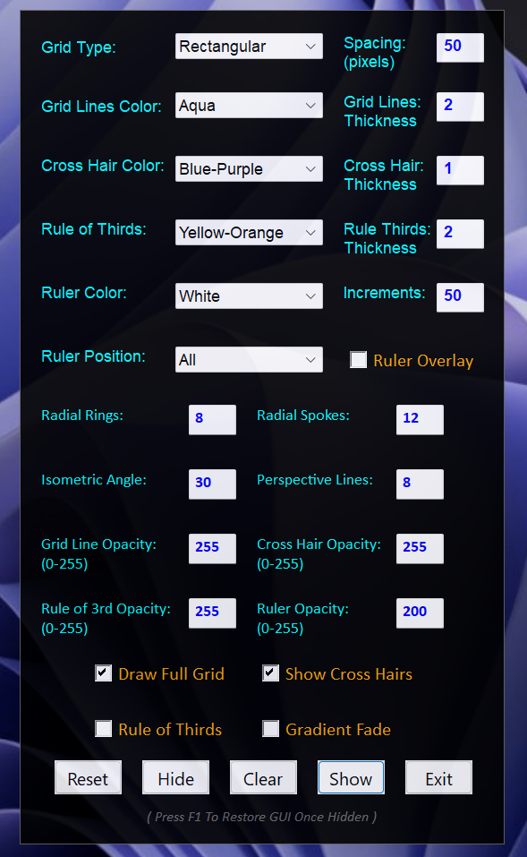
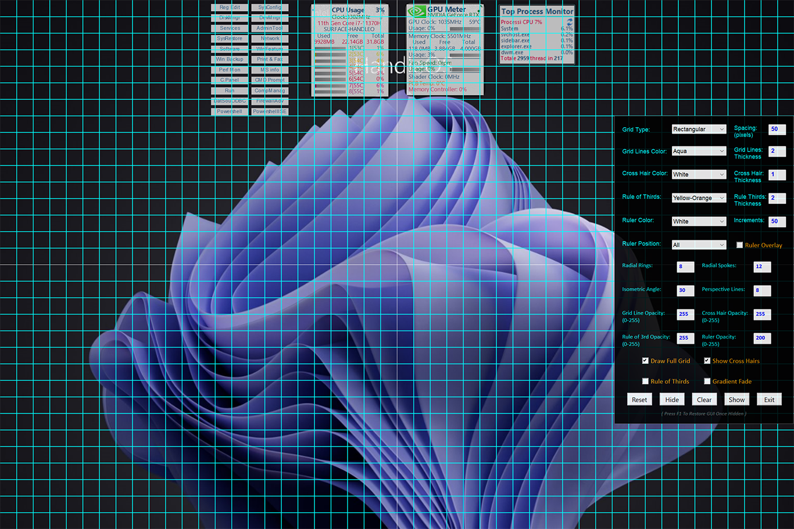
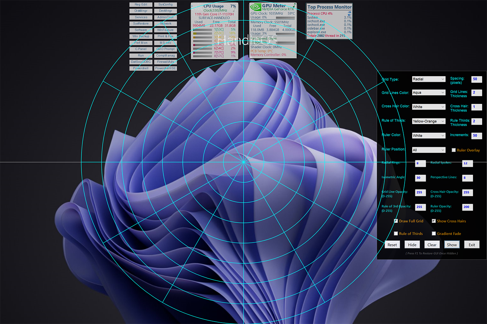
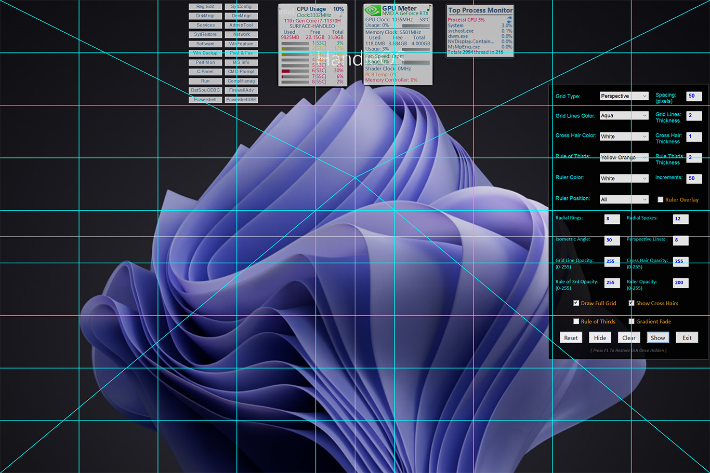

# Grid Master

**Grid Master** is a lightweight and portable utility built for those who crave **pixel-perfect alignment** on their screen. 📌 [Official Forum Topic on AutoHotkey Forum](https://www.autohotkey.com/boards/viewtopic.php?f=6&t=137889) . Grid Master displays a customizable grid overlay that helps you align widgets, windows, and other UI elements with surgical precision.

---

## 📢 NEW VERSIONS

Thanks to the contributions of **@V0RT3X**, Grid Master now includes **two new versions** in addition to the original:

### Grid Master 2.0
An improved and optimized version of the original Grid Master:

- Code has been fully refactored and **optimized for better performance**.

- The necessary **GDI+ functions** are now embedded directly, making it **fully self-contained**.

- Grid logic has been rewritten to start from **custom (x0, y0) coordinates**, offering an **alternative grid layout method**.

- Maintains the core feel of the original but **improves modularity and clarity**.

  

---

### 🎨 Grid Master Mod By V0RT3X (UI Variant by @V0RT3X)
This version introduces a completely redesigned GUI with additional customization options:

- Fully revamped **GUI layout** with a **slightly transparent background**.
- **Grid lines and center lines** are now handled separately:
  - Custom **colors** and **thickness** for each.
  - Option to **toggle center lines** on/off.
- Enhanced **color mapping**, supporting primary, secondary, tertiary colors and all official AHK color names.
- The window is now **draggable** for convenience and better screen interaction.

🖼️ Screenshot:

 

 

 

 

---

## 🧩 Features (Original Version)

- Shows **2 central crosshair lines** (horizontal and vertical) as default.
- Enable the `Draw Full Grid` mode to show a complete, evenly spaced grid across your screen.
- Customize **color** and **thickness** of the grid lines.
- Ideal for **UI/UX designers**, **mockup builders**, or anyone obsessed with visual order.
- Access all options via the **System Tray icon**.
- ⎋ Press the `ESC` key at any time to quickly close the app.

---

## What’s It For?

While originally designed to help align **screen widgets** with precision, Grid Master is flexible and can be useful for:

- Graphic layout design
- Temporary visual overlays
- Precise screen recordings or screenshots
- Interface testing
- Presentations or teaching aids

Let your imagination decide how to use it.

---

## 📦 Portable by Design

No installation required! You can:

- Run Grid Master from **any folder**
- **Carry it on a USB stick**
- Place it anywhere convenient on your system

---

## 📸 Screenshots

Here are some examples of Grid Master in action:

  
  

---

## 🚀 Getting Started

1. Download `GridMaster.exe` or `GridMasterMod_By_V0RT3X.exe` and use the version that best suits your needs.
2. Launch the program.
3. Use the **Main Page** to access options like full grid mode or colour settings.
4. Press `ESC` to Close the Program.

---

## 📜 License

Released under the **MIT License**.

---

## 🤝 Contributing

Suggestions, improvements, and bug reports are welcome! Feel free to open an [Issue](https://github.com/your-username/GridMaster/issues) or a [Pull Request](https://github.com/your-username/GridMaster/pulls).

Special thanks to **@V0RT3X** for his excellent contributions and creative enhancements.

---

## ☕ Donation

If you enjoy using this software and find it helpful and you have the possibility, please consider making a small donation to support the ongoing development of this and other projects. Your generosity is greatly appreciated!

**PayPal**:  

**Ko-fi**:  
